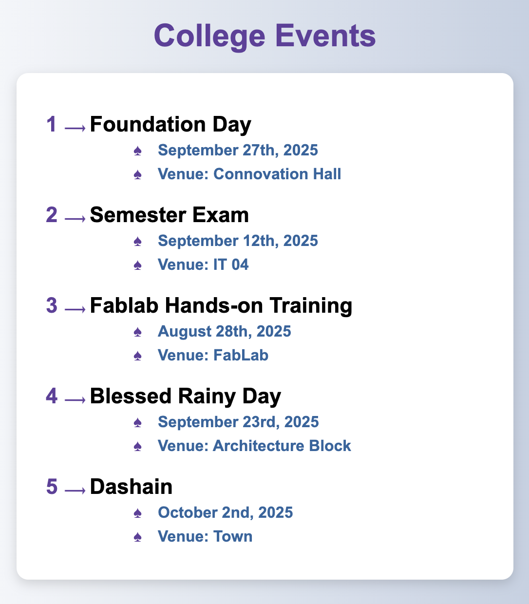

list.html

Each event should include the event name, time, and location as nested unordered list. 
Style the list using CSS to make it stand out: 
Use custom bullets or numbers instead of default ones 
Add hover effects that change the color of the text or background when the user hovers over an event. 

Output 

table_exercise.html

Table to keep track of your grades throughout the semester.  
List all your modules, assignments, exams, and their respective scores.  
The table should include the following columns: 
Module 
Assignment/Exam Name 
Maximum Marks 
Marks Obtained 
Percentage 
Grade 

Output 

